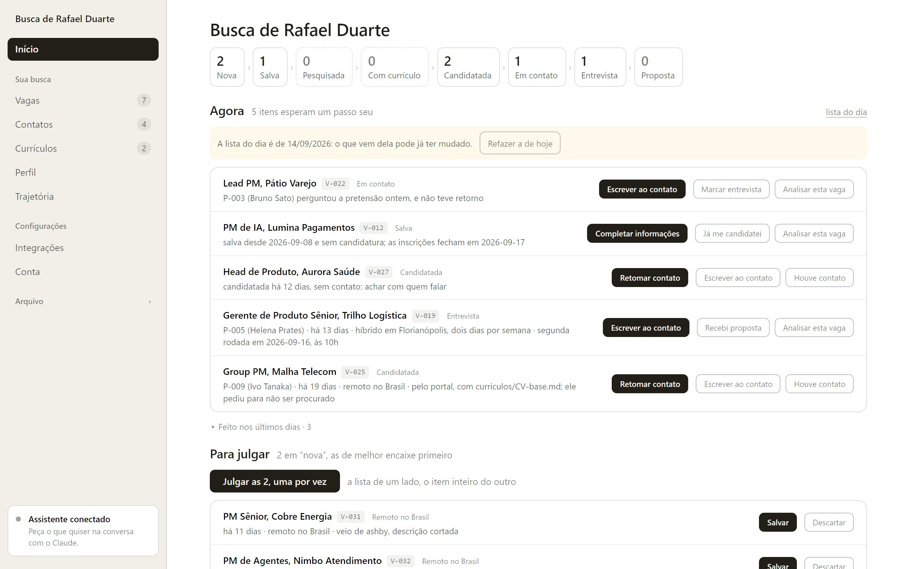

# Oficina

[](https://github.com/kapstanhq/oficina/actions/workflows/ci.yml)
[](LICENSE)

**Ferramentas de IA por profissão, em português. Gratuitas e de código aberto.**

Cada **pack** é um conjunto de ferramentas de um ofício. Você instala uma vez e
passa a ter comandos prontos para o que você faz todo dia — escrever, responder,
conferir, lembrar. Tudo o que você conta fica em arquivos seus, numa pasta do seu
computador, e você não repete a mesma informação duas vezes.



<sub>O painel do pack de vagas, com a busca de uma pessoa fictícia. Ele abre no
seu navegador e lê só a pasta do seu computador.</sub>

---

## Packs

| Pack | Para quem | O que faz | Onde funciona |
|---|---|---|---|
| [**vagas**](vagas/) | Quem procura emprego, em qualquer profissão | Entrevista que monta o seu perfil, busca em fontes públicas, triagem contra o que você procura, currículo em PDF a partir da sua trajetória e candidatura preparada campo a campo | Claude Code |
| [**prospeccao**](prospeccao/) | Quem prospecta o próprio cliente — fundador, consultor, dono de agência | Perfil de cliente, estudo da conta com procedência, abordagem escrita, retomada com gancho novo e a lista do dia | Claude Code, ou colado em qualquer IA |
| [**corretor**](corretor/) | Corretor de imóveis | Anúncio, matrícula, resposta de lead, visita, retomada de contato, documentos e a lista do dia | Claude Code, ou colado em qualquer IA |

Em estudo: **médico e clínica** e **advogado**.

---

## Começar

Vale para qualquer pack, e leva uns cinco minutos. É o caminho que testamos.

1. **Tenha o [Claude Code](https://claude.com/product/claude-code)** — no
   terminal ou no app de desktop. Ele é pago.
2. **Instale o [Node.js](https://nodejs.org)** 20.19 ou mais novo — é "avançar,
   avançar". Ele roda o painel, os conectores e os documentos, só no seu
   computador.
3. **No Claude Code, cole** (troque `vagas` pelo pack que você quer):
   ```
   /plugin marketplace add https://github.com/kapstanhq/oficina.git
   /plugin install vagas@kapstan-oficina
   ```
4. **Comece:**
   ```
   /vagas:comecar
   ```
   Ele pergunta uma coisa de cada vez — a primeira é em que pasta a sua base vai
   morar —, salva conforme avança, e você pode parar no meio e voltar depois.

A partir daí você pede em português: "o que eu faço hoje?", "busca vagas para
mim". Para atualizar: `/plugin marketplace update kapstan-oficina`.

<details>
<summary>Por que a URL inteira, e não <code>kapstanhq/oficina</code></summary>

O atalho clona por SSH e falha em quem não tem chave carregada no ssh-agent. A
URL com `.git` clona por HTTPS e funciona em qualquer máquina.
</details>

---

## Sem o Claude Code

**Os packs `corretor` e `prospeccao` também funcionam colados.** No ChatGPT, no
Gemini ou no Claude do navegador não se instala ferramenta: cola-se um prompt —
o pack inteiro num texto só.

O caminho mais curto é montar o seu na página do pack:
[corretor de imóveis](https://kapstan.com.br/oficina/corretor-de-imoveis) ou
[prospecção](https://kapstan.com.br/oficina/prospeccao). Você escolhe onde usa
IA e quais ferramentas quer, e o texto sai pronto, com um botão de copiar.
Prefere o arquivo? Ele está em [`corretor/PROMPT.md`](corretor/PROMPT.md) e
[`prospeccao/PROMPT.md`](prospeccao/PROMPT.md): copie o que estiver entre as
duas marcas `---8<---`.

| Onde | Como guardar o prompt |
|---|---|
| **Gemini** (grátis) | **Gems** → **Novo Gem** → cole em instruções, e anexe os arquivos da sua carteira em **Conhecimento** |
| **ChatGPT** na web ou no celular | um **Projeto** ou um **GPT** → cole em **Instruções**, e suba a carteira em **Arquivos** |
| **Claude** no navegador | **Projetos** → **Novo projeto** → cole em **Instruções do projeto** |

O prompt entrega o texto — o anúncio, a matrícula lida, o estudo da conta, a
abordagem. O que ele não faz sozinho é **lembrar**: retomar contato na hora
certa, não escrever para quem pediu para parar, montar a lista do dia. Isso
depende dos arquivos, e só o pack instalado os lê.

**O pack `vagas` não funciona colado.** Ele guarda a busca numa pasta do seu
computador e roda programas nela — a busca nas fontes, o painel, o currículo em
PDF —, e o chat da web não chega lá.

<details>
<summary>Codex, Cursor, Copilot ou o ChatGPT do computador (não testado)</summary>

As skills seguem um formato aberto, e as de `corretor` e `prospeccao` carregam
nesses programas. Entram só as skills, sem o painel. Cole no seu agente:

```
Instale o pack <pack> da Oficina Kapstan, do repositório público
https://github.com/kapstanhq/oficina — <pack> é corretor ou prospeccao.

1. Descubra a pasta de skills da ferramenta em que você roda:
       Codex ou ChatGPT no computador  ~/.agents/skills
       Copilot ou Cursor               .agents/skills
       outra                           a que a sua documentação indicar
   Se você for o Codex, o $skill-installer faz isto sozinho.
2. Baixe o repositório para uma pasta temporária.
3. Copie todas as pastas de <pack>/skills/ para a pasta de skills, inteiras —
   inclusive a subpasta references/, que as skills leem para funcionar.
4. Confira que cada pasta copiada tem um SKILL.md e um references/CONTRATO.md,
   e me diga quantas chegaram.
5. Apague a pasta temporária e me diga o comando para começar: /comecar.

Antes de começar, me mostre o que você vai fazer e em que pastas vai escrever.
```
</details>

---

## Onde ficam os seus dados

Numa pasta do seu computador, e você escolhe qual. São arquivos de texto
comuns: você abre no Bloco de Notas, imprime, copia para um pendrive. A árvore é
a mesma em todo pack — o que muda é o nome das pastas. No de vagas:

```
busca/
├── vagas/
│   └── V-012-lumina-pagamentos.md
├── contatos/
│   └── P-003-bruno-sato.md
├── curriculos/
├── perfil.md
├── trajetoria.md
├── hoje.md
└── funil.md
```

**A Kapstan não recebe nada.** Não existe servidor nosso no meio, nem conta
nossa. E nada fica preso: se você parar de usar as ferramentas amanhã, os
arquivos continuam lá e continuam legíveis.

---

## O que estas ferramentas nunca fazem

| Não fazem | Por quê |
|---|---|
| Mandar em lote, ou mandar sem você ver | Com um conector ligado, elas mandam uma por vez — quem recebe e o texto inteiro aparecem na sua tela antes. Sem ele, escrevem e quem envia é você. |
| Inventar informação | O que não foi apurado aparece como `?` e vira pergunta. O currículo só diz o que está na sua trajetória. |
| Decidir por você | Preço, aceitar proposta, dizer que um documento está em ordem, enviar uma candidatura: elas mostram o que olhar e param. Enviar por você é uma escolha que você liga, e cada envio passa pela sua aprovação. |

Cada pack tem uma seção com os limites daquele ofício, escrita antes de
instalar e não depois.

---

## Contribuir

Conte **o que você reescreve toda semana**. É disso que sai a próxima ferramenta
e a próxima profissão: [abra uma questão](https://github.com/kapstanhq/oficina/issues/new/choose).

O código inteiro está aqui — as skills, o motor que as monta, o painel, os
conectores e as provas —, e pull request é bem-vindo. Metade do que está dentro
de cada pack é gerado a partir de uma fonte: o [CONTRIBUTING.md](CONTRIBUTING.md)
diz onde fica a fonte de cada coisa, como provar a mudança e como começar um
pack novo. Achou um problema de segurança? Veja o [SECURITY.md](SECURITY.md).

---

## Quem faz

[Kapstan](https://kapstan.com.br) — produto, IA e crescimento. A Oficina é
aberta e gratuita, e continua assim.

## Licença

MIT. Pode usar, mudar e distribuir, inclusive comercialmente.
